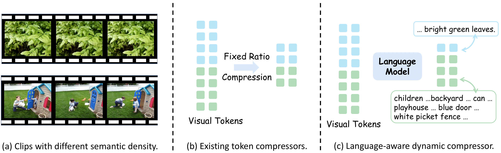
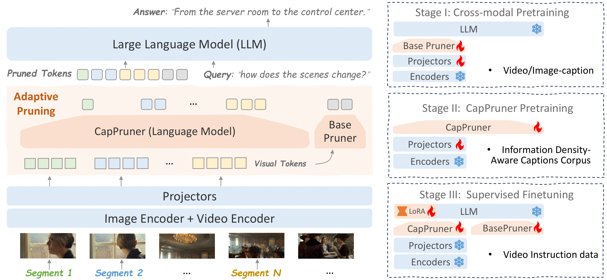

<div align="center">
  <h1>Seeing More, Saying More: Lightweight Language Experts are Dynamic Video Token Compressors</h1> 
</div>


## LangDC Overview 

Current large video-language models face efficiency issues due to processing massive visual tokens. Existing fixed-ratio token compression ignores varying semantic density across video clips. Consequently, this lead to inadequate representation of information-rich clips due to insufficient tokens and unnecessary computation on static or content-poor ones. To address this, we propose LangDC, a Language-aware Dynamic Token Compressor. LangDC leverages a lightweight language model to describe video clips, converting them into soft caption tokens as visual representations. Trained with our proposed semantic density-aware supervision, LangDC aims to 1) cover key visual cues necessary for downstream task reasoning and 2) dynamically adjust compression ratios based on scene richness, reflected by descriptions length.

<p align="center">
  
</p>

## Contributions 
1) We propose LangDC, a novel language-aware token compression strategy. Using soft language tokens for visual representation, it adaptively adjusts compression ratios, improving token utilization over fixed-ratio techniques. 

2) We propose semantic density-aware supervision for the token compressors. By explicitly providing reconstruction targets for token compression, we enable the derivation of a more compact feature set that is not only aware of information richness but also preserves key visual cues. 

3) Experimental results demonstrate that our method reduces FLOPs by 49\% relative to the strong baseline VideoGPT+, while maintaining competitive performance. Additional qualitative results show adaptive compression based on video clip semantic density.

<p align="center">
  
</p>

## Installation

We recommend setting up a conda environment for the project:
```shell
conda create --name=langdc python=3.11
conda activate langdc

git clone https://github.com/NIneeeeeem/LangDC.git
cd LangDC

pip install torch==2.4.0 torchvision==0.19.0 --index-url https://download.pytorch.org/whl/cu124
pip install transformers==4.41.0

pip install -r requirements.txt

export PYTHONPATH="./:$PYTHONPATH"
```
Additionally, install [FlashAttention](https://github.com/HazyResearch/flash-attention) for training,
```shell
pip install ninja

git clone https://github.com/HazyResearch/flash-attention.git
cd flash-attention
python setup.py install
```
---

## Quantitative Evaluation 📊
We provide instructions to reproduce LangDC results on MVBench, VideoMME. Please follow the instructions at [eval/README.md](eval/README.md).


## Citations 📜:

If you're using LangDC in your research or applications, please give us a star ⭐ to support us and cite using this BibTeX:
```bibtex

```

## Acknowledgements 

+ [Video-ChatGPT+](https://github.com/mbzuai-oryx/VideoGPT-plus): A pioneering attempt in Video-based conversation models.
+ [LLaVA](https://github.com/haotian-liu/LLaVA): Our code base is build upon LLaVA and Video-ChatGPT+.